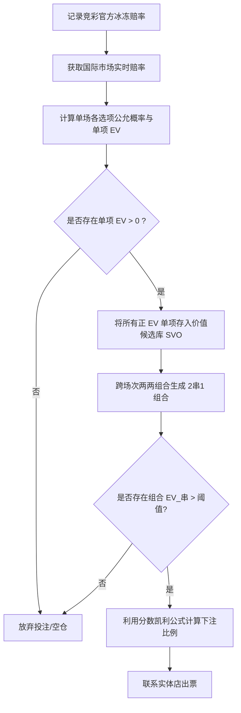

# 基于竞彩“赔率冰冻期”的正期望值（+EV）投注策略指南

本指南旨在利用中国体育彩票（竞彩）在比赛日临场前特有的“赔率冰冻期”（Stale Pricing Window），对比国际锐博的实时赔率变化，识别并捕捉正期望值（+EV）的投注机会。

## 数据源与获取渠道
* **中国竞彩数据源**：[中国竞彩网官方赔率页面](https://www.sporttery.cn/jc/zqszsc/)
* **Pinnacle 数据源**：[Pinnacle 官网世界杯对决页面](https://www.pinnacle.com/zh-CN/soccer/fifa-world-cup/matchups/#all)

## 适用玩法范围
本策略当前主要针对中国体彩的以下 **3 种** 核心玩法：
1. **胜平负**（常规 1X2，对应 Pinnacle 的“输赢盘”）
2. **让球胜平负**（包含让球的 1X2，对应 Pinnacle 的“让分盘”）
3. **总进球数**（包含 0 至 7+ 个进球数选项）

---

## 一、 核心方案与套利原理

### 1. 现象定义：赔率冰冻期（Stale Pricing Window）
中国竞彩的官方变赔频率较低。在比赛日当晚进行最后一次更新后，赔率将完全静止，直至销售截止。这中间存在一个约 1.5 至 2.5 小时的“冰冻期”。

```
[竞彩最后变赔] ───( 赔率冰冻 / 市场变化真空期 )───► [竞彩售票截止]
                               ▲
                       [国际市场赔率变动]
                (国际赔率发生剧烈波动，竞彩无法响应)
```

### 2. 核心原理：市场滞后性与信息不对称
在竞彩赔率冰冻期间，国际市场（如 Pinnacle）的赔率仍在实时反映资金流和最新资讯（如首发名单公布、临场伤病等）。此时：
* **国际锐博赔率**：实时调整，体现最新的“公允概率”。
* **中国竞彩赔率**：保持冰冻，维持变赔前的老旧估值。
* 当两者偏差大于竞彩的抽水率时，即在竞彩侧产生了数学上的**正期望值（+EV）**投注机会。

---

## 二、 数学公式与计算模型

要识别价值投注，必须通过以下数学公式将“赔率”转换为“公允概率”，并计算“期望值”。

### 1. 国际赔率去抽水（Marginal Removal）
设国际锐博某玩法的各个互斥结果对应的赔率为 $O_1, O_2, \dots, O_n$（例如胜平负玩法中 $n=3$）。
首先计算庄家的总抽水（Margin）比例 $M$：
$$M = \left( \sum_{i=1}^{n} \frac{1}{O_i} \right) - 1$$

利用比例去抽水法（Proportional Method），求得每个结果的**公允概率（Fair Probability）** $P_i$：
$$P_i = \frac{1}{O_i \times (1 + M)}$$

> [!TIP]
> 也可以使用更精确 of **Shin 去抽水法** 或 **指数法（Logarithmic Method）**，以更好地修正长尾低概率事件的偏差。

### 2. 竞彩期望收益（Expected Value, EV）计算
将上一步计算出的公允概率 $P_i$，与国内竞彩对应的冰冻赔率 $O_{\text{竞彩}, i}$ 进行对比：
$$EV_i = P_i \times O_{\text{竞彩}, i} - 1$$

* **若 $EV_i > 0$**：该选项具有正期望值，即“价值投注点”。
* **若 $EV_i \le 0$**：该选项为负期望值（即使竞彩赔率高于国际赔率，但不足以击穿抽水率）。

### 3. 2串1（双场串关）的期望值计算与复利效应
在实际操作中，中国竞彩的大多数普通联赛赛事并不开售“单关”胜平负，而是强制要求进行 **“2串1”** 投注（即必须同时猜中两场独立比赛）。在这种限制下，期望值（EV）的计算将产生**乘数效应（复利效应）**。

对于由两个独立事件组合而成的 2串1 投注：
* **组合赔率**：$$Odds_{\text{串}} = Odds_A \times Odds_B$$
* **组合公允概率**：$$P_{\text{串}} = P_A \times P_B$$
* **组合期望值（$EV_{\text{串}}$）**：
  $$EV_{\text{串}} = (P_A \times P_B) \times (Odds_A \times Odds_B) - 1$$

通过单场期望值 $EV_A$ 和 $EV_B$ 可以直接推导为：
$$EV_{\text{串}} = (EV_A + 1) \times (EV_B + 1) - 1$$

#### 期望值的复利特征：
1. **负期望值加速放大（亏损更惨）**：若两场均为普通投注，单场期望均为 $-13\%$：
   $$EV_{\text{串}} = (1 - 0.13) \times (1 - 0.13) - 1 = -24.31\%$$
   *后果*：你的长期亏损率从单场 13% 暴增至 24.31%。这是庄家极力鼓励串关的核心原因。
2. **一正一负互相吞噬（凑单陷阱）**：若选中一项 $+10\%$ EV 的红单，但为凑单随便搭了一场 $-15\%$ EV 的比赛：
   $$EV_{\text{串}} = (1 + 0.10) \times (1 - 0.15) - 1 = -6.5\%$$
   *后果*：第二场的负期望直接吃掉了第一场的全部利润，组合后仍然是输钱单。
3. **双正期望值复利叠加（职业套利）**：若两场均判定为正期望，分别为 $+5\%$ 和 $+10\%$：
   $$EV_{\text{串}} = (1 + 0.05) \times (1 + 0.10) - 1 = \mathbf{+15.5\%}$$
   *后果*：组合后的期望值会呈指数式上升，回报率甚至超过任意单一投注。

---

## 三、 落地执行步骤（SOP）

本业务流程展示了本算法的核心逻辑流。程序具体的启动时间与频次由用户根据实际策略自行决定。



### 核心步骤说明：
1. **单场 EV 过滤**：运行去抽水公式，计算出各单项的公允概率 $P_i$ 以及单场 $EV_{\text{单}}$。筛选出所有 $EV_{\text{单}} > 0$ 的选项作为“单场价值对象（SVO）”，存入候选库。
2. **跨场次组合搜索**：对候选库中的所有 SVO 进行两两组合，必须满足 `Match_ID_A != Match_ID_B`（即不能串同一场比赛的不同玩法）。对每一个 2串1 组合计算 $EV_{\text{串}} = (EV_A + 1) \times (EV_B + 1) - 1$。
3. **资金分配**：对通过过滤的 2串1 组合，采用**分数凯利公式**计算合理的投注比例：
   $$f^* = \text{Fraction} \times \frac{EV_{\text{串}}}{Odds_{\text{串}} - 1}$$
   （注：由于 2串1 的胜率偏低，Fraction 建议设为 `0.1` 即十分之一凯利，以平滑回撤波动）。

---

## 四、 限制性因素与风险控制

在实际操作中，必须防范以下系统性和操作性风险：

### 1. 竞彩官方的风控拦截（一键关盘）
* **风险**：当首发消息导致国际赔率波动过于剧烈时，竞彩风控系统可能会在几分钟内直接选择**“关盘”（暂停销售）**，而不是调整赔率。
* **对策**：必须在国际赔率开始松动的前期完成分析并迅速出票。

### 2. 实体出票的物理时延（Slippage）
* **风险**：竞彩出票必须依赖实体店终端机。接近截止时间时，全国终端机往往面临拥堵。你的指令发给彩店老板后，如果出票延迟或网络卡顿，一旦拖过截止时间将无法成交。
* **对策**：
  * 设置较早的截止时间（如截止前 10 分钟停止接收新指令）。
  * 寻找出票设备空闲、反应迅速的合作店主。

### 3. 玩法与串关限制（2串1的凑单惩罚）
* **风险**：中国竞彩的许多比赛不开放“单关”胜平负，强制要求“串关”（至少选两场）。串关会导致两场比赛的抽水率相乘，极大地压低了整体 EV。
* **对策**：**绝对不可为了凑 2串1 而强行购买任何未经过 EV 验证（$EV \le 0$）的常规选项（凑单陷阱）。** 必须严格遵循“双正 EV 组合算法”。如果当晚所有可售比赛中只筛选出一个正 EV 选项，无法配对，则必须选择**空仓（放弃投注）**。宁可错失，绝不凑单。

### 4. 赛事时间错配
* **风险**：若比赛在深夜或凌晨开赛，其首发公布时间已经在竞彩截止销售之后。
* **对策**：对于深夜赛事，无法利用首发公布的瞬时套利。只能利用截止售票前，由于国际市场资金大量注入导致的赔率平缓飘移。此类机会的 $EV$ 往往较小，需更精确的监测。

---

## 五、 运行频次与时间窗口建议

本部分提供两种实际运行该算法的策略建议，用户可根据时间成本和技术开销自由选择：

### 方案 A：轻量级“双频手动”模式（个人彩民推荐）
不需要挂载高频实时监控或复杂的 API 接口，每日只需主动运行两次算法：
1. **第一次运行（白天，12:00 - 15:00 之间）**：
   * **数据获取**：手动记录 [中国竞彩网官方赔率页面](https://www.sporttery.cn/jc/zqszsc/) 和 [Pinnacle 官网世界杯对决页面](https://www.pinnacle.com/zh-CN/soccer/fifa-world-cup/matchups/#all) 上的数据。
   * **目的**：剔除毫无套利可能的比赛，计算单场初始 EV，锁定晚间需要重点观察的“候选组合”，做到心中有数。
2. **第二次运行（临场，21:30 前后）**：
   * **最佳时机**：竞彩截止售票通常在晚上 22:00，而 21:00 左右当日赛事的首发阵容已经完全公开。此时国际市场的赔率完成了对阵容和突发伤病的全部定价，真实度极高，而竞彩赔率自 20:18 后处于冰冻状态。
   * **目的**：在 21:30 手动记录以上两个数据源的最新赔率并录入算法，计算最终的组合期望值 $EV_{\text{串}}$，若存在 $>8\%$ 的高 EV 组合，在 21:55 前联系实体店出票。

### 方案 B：高频自动监控模式（量化系统推荐）
如果您拥有 API 或稳定的爬虫数据源，可以采用自动监控：
1. **运行窗口**：在比赛日特定时间段内（例如 20:20 至 22:00）启动脚本。
2. **运行频次**：设置定时任务，每隔较短时间（例如 30 秒）自动从相关接口拉取数据并运行组合筛选。
3. **目的**：第一时间捕捉由于首发公布、盘口瞬时暴跌而产生的套利窗口，自动触发警报推送，赶在竞彩系统反应过来“关盘”前完成下注。
